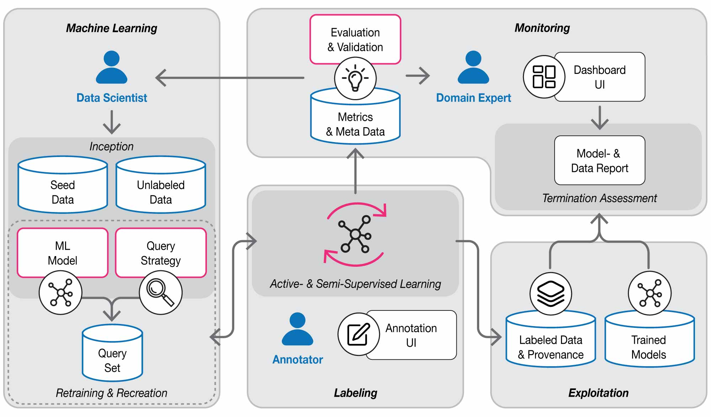

# LIFEDATA



## Usage

Create a project specific conda environment (e.g. `conda create -n myproject python=3.10`) or use your conda base environment

Install lifedata in your environment via `pip install lifedata`

After lifedata installation use `lifedata --help` to get help for lifedata commands

Generate your LIFEDATA project by using the [project template](https://github.com/ds-lab/lifedata-project-template) `lifedata init <project instance name>`

Further steps can be found in the project's README.

## Custom Development

### Setup

To create your local development environment (e.g. for integration with your IDE) run:

```bash
conda env create
```

This will create you a local environment called `lifedata` with all necessary dependencies installed.

### Run development server

To start the project related services run:

```bash
docker-compose up
```

You can then access the frontend at http://localhost:3000/ in your browser. The API is available at http://localhost:8000/ and is also proxied via the frontend (to avoid CORS issues).

Storybook can be accessed at http://localhost:3001

### Tests

There are tests for the python code as well as tests for the TypeScript based frontend code.

#### Python Tests

To always keep the tests running and see if everything is still working as expected, run::

    ptw

To run the tests once, just do: `py.test`

#### TypeScript Tests

Run `yarn test` in the `webui` directory.

### Database Migrations

If you want to adjust the database tables, you also need to prepare a migration script using `alembic` in order to provide executable instructions on how to alter the database.

For most cases it's sufficient to change the table definitions in the code and then run::

    docker-compose run --rm webapi alembic revision --autogenerate -m "your change message here"

Now inspect the auto generated file if everything is as it is supposed to be.

Then run `alembic upgrade head` in the `api` container to apply these changes to your local database.

## Citation

coming soon
